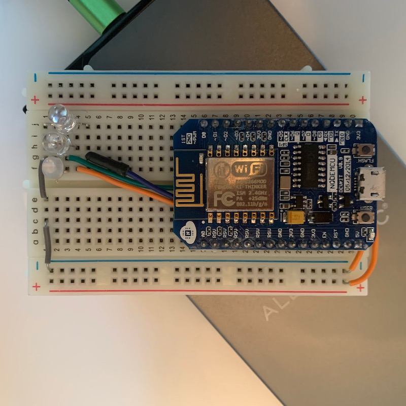
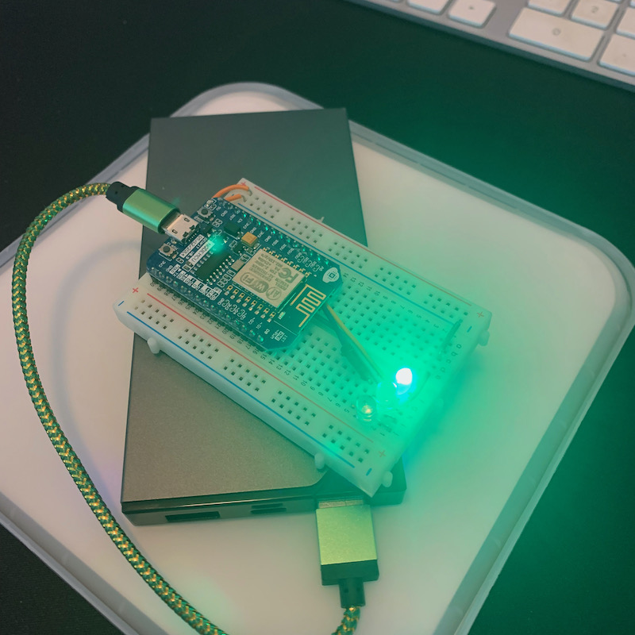
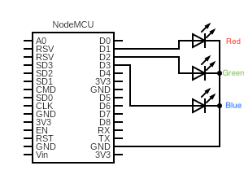

# Teams On-Air 
## Physical On-Air light
This is the code and documentation for the physical on-air light

 
 
 

# Components
 - ESP8266 Board https://www.aliexpress.com/item/33051171807.html
 - Bread Board https://www.aliexpress.com/item/4000805673115.html
 - Powerbank https://www.pbtech.co.nz/product/BAPMIX22234/Xiaomi-Mi-20000mAh-Power-Bank-3-Pro-Edition---Blac 
 - Red, Green, Blue LEDs https://www.aliexpress.com/item/32848822296.html
 - Wire https://www.aliexpress.com/item/1005002553296334.htm
 - 25cm USB to USB Micro cable https://www.aliexpress.com/item/4001177937131.html

# Development Environment
You will need Arduino IDE to upload this program to the ESP8266 board.

Download [here](https://www.arduino.cc/en/software)

You will also need to download the drivers for the ESP8266 board. To do this:

 1. Open Arduino IDE
 2. Go to Prefrences > Board Manager URLs
 3. Paste the following URL into that box
    `http://arduino.esp8266.com/stable/package_esp8266com_index.json`
 4. Click OK
 5. Go to Tools > Board > Boards Manager
 6. Search for `esp8266` and click Install
 7. Once installed go Tools > Board > ESP 8266 > Node MCU 
 8. Choose the right COM port

You will also need to add the following libraries (Tools > Manage Libraries):
 - **PubSubClient** by Nick O'Leary
 - **ArduinoJson** by Benoit Blanchon

# Circuit Diagram

 

Connections:

 - NodeMCU D1 ➡ Red LED + ➡ Red LED - ➡ GND
 - NodeMCU D2 ➡ Green LED + ➡ Green LED - ➡ GND
 - NodeMCU D3 ➡ Blue LED + ➡ Blue LED - ➡ GND

# Config File (config.h)

The [config file](Teams-Lighting-Controller/config.h) contains the following values that need to be set:

| Config Value         | Description                                                                                                                                                                 |
|----------------------|-----------------------------------------------------------------------------------------------------------------------------------------------------------------------------|
| CONFIG_WIFI_SSID     | The name of your wifi network                                                                                                                                               |
| CONFIG_WIFI_PASSWORD | The password to your wifi network                                                                                                                                           |
| CONFIG_AWS_ENDPOINT  | Retrieve this from AWS Console. [IoT Core Console > Settings](https://console.aws.amazon.com/iot/home?region=us-east-1#/settings) > Device data endpoint. Copy the full URL |
| CONFIG_AWS_REGION    | The AWS region (us-east-1)                                                                                                                                                  |
| CONFIG_DEVICE_NAME   | The name of this device (must match the device name in AWS IoT)                                                                                                             |
| CONFIG_PEM_CRT       | The device certificate (see instructions below)                                                                                                                             |
| CONFIG_PEM_KEY       | The device private key (see instructions below)                                                                                                                             |
| CONFIG_CERT_CA       | The CA Cert for AWS IoT - this is unlikely to change as it expires in 2038!                                                                                                 |

# Generating the device certificate
Once the [infrastructure](../infrastructure/README.md) has been spun up you will need to generate the device certificate and key for this light. To do this:

 1. Go to the [AWS IoT Console > Manage > Things > OnAir001](https://console.aws.amazon.com/iot/home?region=us-east-1#/thing/OnAir001) > Certificates > Create Certificate

 2. In the popup box:
    1. Click `Activate Certificate`
    2. Download the Device certificate you just activated
    3. Download the private key 
    4. Download the public key (though you wont need it)
    5. Click Done

 3. Attach the policy to the certificate
    1. Click on the certificate ID you just created 
    2. Click actions > Attach policy
    3. Choose TeamsOnAir-main-iotpolicy-xxxxxxxxxx
    4. Click attach

## Using device certificates in the config file
Copy the values of the private key and the device certificate into the `config.h` file

# Getting Started
1. Install the Arduino IDE
2. Install the ESP8266 Drivers
3. Choose the NodeMCU board from Tools > Boards
4. Plug in the ESP8266 into your computer
5. Choose the correct COM port for the board (make sure you hold down FLASH button when plugging it into the computer)
6. Install the needed libraries
7. Open the 4 files in the [Teamps-Lighting-Controller](Teams-Lighting-Controller) directory
8. Edit the config.h file to have all the necessary values
9. Compile the program
10. Push the program to the board

# LED Status Lights
The board indicates its status using the LEDs when it starts up. Below are the states you will observe when the board starts up:

| LED Pattern                | Meaning              |
|----------------------------|----------------------|
| Pulsing Blue               | Connecting to Wifi   |
| Pulsing Green + Blue       | Connected to Wifi    |
| Pulsing Red + Green + Blue | Connected to AWS IoT |

# Debugging
The board writes out to Serial (115200). 
You can see logs in the Serial Monitor in the Arduino IDE

Tools > Serial Monitor