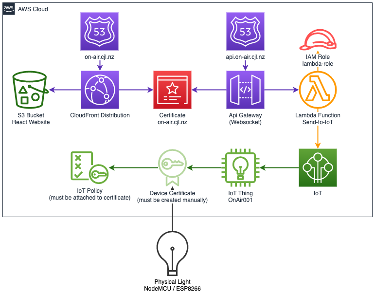

# Teams On-Air Infrastructure

This is the infrastructure for the **Teams On-Air** site.

See the architecture diagram below:



## Manual Setup
Spinning up the infrastructure will work, but in order to connect the physical light to AWS IoT you will need to:

 1. Create a Device certificate 
 2. Attach the IoT Policy

For more information on this see the instructions in the [ESP8266-Board README](../ESP8266-Board/README.md)

## CloudFormation Parameters
There are some cloudformation parameters that will need to be set in order to get the stack to deploy and work:

| CfnParameter | Description                                                                                                                                      |
|--------------|--------------------------------------------------------------------------------------------------------------------------------------------------|
| branch-name  | The name of the branch this stack is deployed from. Used to spin up test environments automatically                                              |
| iot-url      | The URL to access your AWS IoT instance. Needed for lambda to communicate with AWS IoT. Something like xxxxxxxxx-ats.iot.us-east-1.amazonaws.com |
|              |                                                                                                                                                  |

Note that you can either override these when doing `cdk deploy` *or* you can change the code in the [infrastructure-stack.ts](lib/infrastructure-stack.ts) file.

## Continuous Delivery Setup ✅

Changes to the infrastructure get deployed straight to production through [Github Actions](https://github.com/chriiiish/teams-on-air/actions)

Check out the deployment plan in `.github/workflows/deploy-infrastructure`

## Getting started from scratch
    
1. Install Node
2. Install the AWS CLI
3. Install the AWS CDK
   `$ npm install -g aws-cdk`
4. Open a terminal and run
   ```
    cd infrastructure/
    npm install
    npm run build
    npm run test
   ```

At this point you should be able to verify that the code builds and the tests run.


## Useful commands

 * `npm run build`            compile typescript to js
 * `npm run watch`            watch for changes and compile
 * `npm run test`             perform the jest unit tests
 * `cdk deploy`               deploy this stack to your default AWS account/region
 * `cdk diff`                 compare deployed stack with current state
 * `cdk synth`                emits the synthesized CloudFormation template
 * `npm run update`           updates the infrastructure snapshot for testing


## Tests
The infrastructure is unit tested. Please write tests for changes to the infrastructure.

**NOTE: infrastructure will not deploy if tests fail**

To run tests locally: `npm run test`

There is a [snapshot test](https://jestjs.io/docs/snapshot-testing) in place. If you are make changes to the infrastructure you will need to update the snapshot. This tells the test runner you _intended_ to make changes to the infrastructure.

To update the snapshot: `npm run update`


## Test Stacks
To generate a production stack do a regular build and deploy.

To generate a test stack (_branch-name_.on-air.cjl.nz) do two things:
1. Export a `STACK_NAME` variable
   `export STACK_NAME="branch-name"`
2. Specify it as a parameter on the deployment
   `npx cdk deploy --require-approval never --parameters subdomain=$STACK_NAME`

We use test stacks to spin up new instances for pull-requests. E.g. if you create a pull request off the `feature/my-test-branch` branch, then it will create a test environment `my-test-branch.on-air.cjl.nz` 

See `.github/workflows/deploy-test-environment-create.yml`